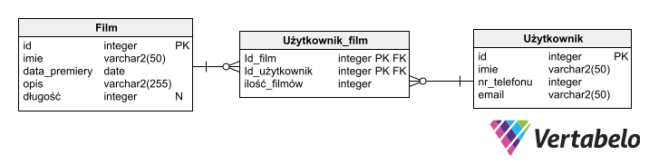

# Wypożyczalnia gier
Cały projekt stworzony na zajecia na przedmiot Technologi Internetu(tin) na PJATK.

Do odpalenia projektu zalecane jest pobranie go na komputer. Instrukcja odpalenia znajduje się ponizej. 

Do odpalenia projektow mp2 i mp3 potrzebny jest nodejs oraz baza mysql zainstalowane na komputerze.

Aplikacja jest zrobiona na podstawie tutorialu udostepnionego na zajeciach z niektorymi funkcjami zrobionymi inaczej lub podobnie.

# mp0
Definicja projektu 

Diagram tabel z bazy danych uzytej w projekcie.


Opis calego projektu znajduje sie w folderze mp0 w formacie word lub pdf 

# mp1
Szablon projektu napisany przy uzyciu html i css. 

Aby odpalic projekt wystarczy pobrac do siebie na komputer i odpalic index.html w folderze mp1

# mp2
Aplikacja korzysta z mysql (w tutorialu podejscie 1).

Czesc projektu w ktorej uzyty jest silnik ejs do renderowania stron.

W katalogu sql znajduje sie plik games.sql ktory zawiera definicje tabel w bazie danych.

Uzyta jest walidacja w joi, api do aplikacji, internacjonalizacje oraz autoryzacje do aplikacji.

## Uruchomienie aplikacji
Po sciagnieciu folderu na komputer nalezy przejsc do folderu mp2 i otworzyc okno konsoli. Nastepnie wykonac ponizsze polecenia
```sh
npm i # instalowanie potrzebnych bibliotek, nalezy wykonac tylko raz
npm start # uruchomie serwera deweloperskiego.
```

Po wykonaniu komendy `npm start` projekt powinien uruchomic sie serwer deweloperski ktory dziala na porcie 3005. Nastepnie nalezy uruchomic przegladarke i przejsc na adres `localhost:3005`

Serwer uzywa nodemon wiec przy edycji i zapisie uruchamiany jest ponownie bez koniecznosci przeladowania programu w terminalu.

# mp3
Czesc aplikacji ktora wykorzystuje serwer oraz api z mp2. Aplikacja frontendowa korzysta z react.

Posiada takze internacjonalizacje, autoryzacje do aplikacji z mozliwoscia stworzenia roli administratora, ktory posiada funckje nadania roli innemu uzytkownikowi. 

Projekt posiada wymaganą na przedmiocie wlasna funkcjonalnosc ktorą jest historia zmian ktore zaszly w aplikacji. 

## Uruchomienie aplikacji
Po sciagnieciu folderu na komputer nalezy przejsc do folderu mp3 i otworzyc okno konsoli. Nastepnie wykonac ponizsze polecenia
```sh
cd mp3
npm i # nalezy wykonac tylko raz
npm start

# otworzyc drugie okno terminala
cd mp3
npm i # nalezy wykonac tylko raz
npm start
```

Aplikacja reacta odpali sie automatycznie w domyslnej przegladarce na domyslnym adresie dla reacta `localhost:300`.

Aplikacja serwerowa z mp2 odpali sie na adresie `localhost:3005`. Aby dostac sie do danych z api nalezy przejsc na adres `localhost:3005/api/users`, `localhost:3005/api/games`, `localhost:3005/api/gameRent`